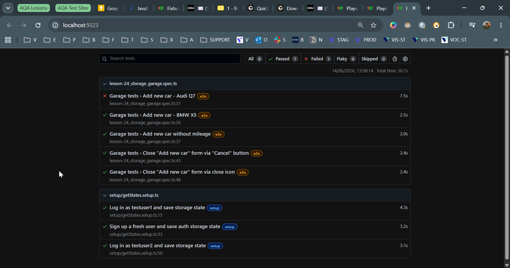

# REPORTING
-----------------------------------------------------------------------
# npx playwright test lesson-24_storage_garage.spec.ts --reporter=list
----

 injected env (0) from tests\.env // tip: ◈ secrets for agents [www.dotenvx.com]
  ✓  1 [setup] › tests\setup\getStates.setup.ts:15:5 › Log in as testuser1 and save storage state (3.4s)
  ✓  2 [setup] › tests\setup\getStates.setup.ts:33:5 › Sign up a fresh user and save auth storage state (3.4s)
  ✓  3 [setup] › tests\setup\getStates.setup.ts:50:5 › Log in as testuser2 and save storage state (3.2s)
◇ injected env (0) from tests\.env // tip: ⌘ enable debugging { debug: true }
  ✓  4 [e2e] › tests\lesson-24_storage_garage.spec.ts:26:9 › Garage tests › Add new car - BMW X5 (2.6s)
  ✘  5 [e2e] › tests\lesson-24_storage_garage.spec.ts:31:9 › Garage tests › Add new car - Audi Q7 (7.7s)
◇ injected env (0) from tests\.env // tip: ⌘ override existing { override: true }
  ✓  6 [e2e] › tests\lesson-24_storage_garage.spec.ts:37:9 › Garage tests › Add new car without mileage (2.0s)
  ✓  7 …lesson-24_storage_garage.spec.ts:43:9 › Garage tests › Close "Add new car" form via "Cancel" button (2.4s)
  ✓  8 …ests\lesson-24_storage_garage.spec.ts:48:9 › Garage tests › Close "Add new car" form via close icon (2.2s)

  1) [e2e] › tests\lesson-24_storage_garage.spec.ts:31:9 › Garage tests › Add new car - Audi Q7 ────

    Error: expect(locator).toHaveValue(expected) failed

    Locator:  locator('[name="miles"]').first()
    Expected: "111"
    Received: "777"
    Timeout:  5000ms

-----------------------------------------------------------------------
# npx playwright test lesson-24_storage_garage.spec.ts --reporter=line
----

◇ injected env (2) from tests\.env // tip: ◈ encrypted .env [www.dotenvx.com]

Running 8 tests using 1 worker
◇ injected env (0) from tests\.env // tip: ⌘ custom filepath { path: '/custom/path/.env' }
◇ injected env (0) from tests\.env // tip: ⌘ suppress logs { quiet: true }
  1) [e2e] › tests\lesson-24_storage_garage.spec.ts:31:9 › Garage tests › Add new car - Audi Q7 ────

    Error: expect(locator).toHaveValue(expected) failed

    Locator:  locator('[name="miles"]').first()
    Expected: "111"
    Received: "777"
    Timeout:  5000ms

◇ injected env (0) from tests\.env // tip: ◈ encrypted .env [www.dotenvx.com]
  1 failed
    [e2e] › tests\lesson-24_storage_garage.spec.ts:31:9 › Garage tests › Add new car - Audi Q7 ─────
  7 passed (36.1s)

-----------------------------------------------------------------------
# npx playwright test lesson-24_storage_garage.spec.ts --reporter=dot 
----

◇ injected env (2) from tests\.env // tip: ◈ encrypted .env [www.dotenvx.com]

Running 8 tests using 1 worker
◇ injected env (0) from tests\.env // tip: ⌘ multiple files { path: ['.env.local', '.env'] }
···◇ injected env (0) from tests\.env // tip: ⌘ enable debugging { debug: true }
T◇ injected env (0) from tests\.env // tip: ⌘ enable debugging { debug: true }
F◇ injected env (0) from tests\.env // tip: ⌁ auth for agents [www.vestauth.com]
···

  1) [e2e] › tests\lesson-24_storage_garage.spec.ts:26:9 › Garage tests › Add new car - BMW X5 ─────

    Test timeout of 30000ms exceeded.

    Error: locator.selectOption: Test timeout of 30000ms exceeded.

 2) [e2e] › tests\lesson-24_storage_garage.spec.ts:31:9 › Garage tests › Add new car - Audi Q7 ────

    Error: expect(locator).toHaveValue(expected) failed

    Locator:  locator('[name="miles"]').first()
    Expected: "111"
    Received: "777"
    Timeout:  5000ms

 2 failed
    [e2e] › tests\lesson-24_storage_garage.spec.ts:26:9 › Garage tests › Add new car - BMW X5 ──────
    [e2e] › tests\lesson-24_storage_garage.spec.ts:31:9 › Garage tests › Add new car - Audi Q7 ─────
  6 passed (1.0m)

-----------------------------------------------------------------------
# npx playwright test lesson-24_storage_garage.spec.ts
playwright.config.ts:

export default defineConfig({
    ...
    reporter: [['list'], ['html']],
    ...
});
----

◇ injected env (2) from tests\.env // tip: ⌘ custom filepath { path: '/custom/path/.env' }

Running 8 tests using 1 worker

◇ injected env (0) from tests\.env // tip: ◈ encrypted .env [www.dotenvx.com]
  ✓  1 [setup] › tests\setup\getStates.setup.ts:15:5 › Log in as testuser1 and save storage state (4.3s)
  ✓  2 [setup] › tests\setup\getStates.setup.ts:33:5 › Sign up a fresh user and save auth storage state (3.2s)
  ✓  3 [setup] › tests\setup\getStates.setup.ts:50:5 › Log in as testuser2 and save storage state (3.1s)
◇ injected env (0) from tests\.env // tip: ⌘ override existing { override: true }
  ✓  4 [e2e] › tests\lesson-24_storage_garage.spec.ts:26:9 › Garage tests › Add new car - BMW X5 (2.5s)
  ✘  5 [e2e] › tests\lesson-24_storage_garage.spec.ts:31:9 › Garage tests › Add new car - Audi Q7 (7.5s)
◇ injected env (0) from tests\.env // tip: ◈ encrypted .env [www.dotenvx.com]
  ✓  6 [e2e] › tests\lesson-24_storage_garage.spec.ts:37:9 › Garage tests › Add new car without mileage (2.0s)
  ✓  7 …lesson-24_storage_garage.spec.ts:43:9 › Garage tests › Close "Add new car" form via "Cancel" button (2.4s)
  ✓  8 …ests\lesson-24_storage_garage.spec.ts:48:9 › Garage tests › Close "Add new car" form via close icon (2.4s)

  1) [e2e] › tests\lesson-24_storage_garage.spec.ts:31:9 › Garage tests › Add new car - Audi Q7 ────

    Error: expect(locator).toHaveValue(expected) failed

    Locator:  locator('[name="miles"]').first()
    Expected: "111"
    Received: "777"
    Timeout:  5000ms

 1 failed
    [e2e] › tests\lesson-24_storage_garage.spec.ts:31:9 › Garage tests › Add new car - Audi Q7 ─────
  7 passed (30.7s)

  Serving HTML report at http://localhost:9323. Press Ctrl+C to quit.

